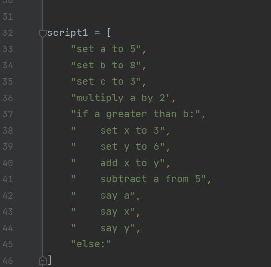
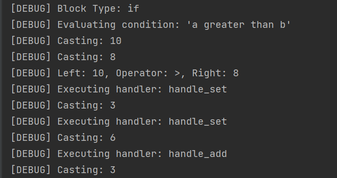

# WhisperLang
# 🗣️ WhisperLang Interpreter (v0.1)

> A plain-English scripting language interpreter built from scratch in Python  
> Designed to parse and execute natural-language logic like `if`, `repeat`, and math operations.

---

## 📌 Features

- ✅ Human-readable scripting (e.g., `set x to 5`, `multiply a by 2`)
- ✅ Math operations: `add`, `subtract`, `multiply`, `divide`, `round`
- ✅ Control flow: `if`, `else`, `while`, `repeat x times`
- ✅ Variable storage and evaluation
- ✅ Modular design (parser, interpreter, math ops, logic, etc.)
- ✅ Debug mode for tracing behavior (`[DEBUG]` logs)

---

## Roadmap

Add functions and return statements,
Support list/array structures,
Implement user-defined commands,
Add runtime state inspection and dump tools,
Develop REPL interface with history and error tracking,

## 🖼️ Demo

### 🧾 Input Script
This is how a script is written in WhisperLang:

### 🔍 Debug Output

The interpreter breaks down logic and provides real-time feedback:

### Author
Joshua Pugh
B.S. in Computer Science & Software Engineering
Diesel Technician turned Developer
